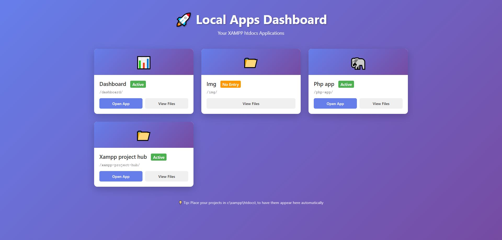

# XAMPP Project Hub

Central hub for accessing all your local XAMPP projects with a beautiful, responsive interface. Auto-scans your htdocs folder and displays all available apps. Perfect for developers managing multiple projects!

## Features

✨ **Auto-Discovery** - Automatically scans and displays all projects in your htdocs folder  
🎨 **Modern UI** - Beautiful, responsive card-based interface  
🏷️ **Smart Detection** - Identifies projects with index.php or index.html  
⚡ **Quick Access** - One-click launch to any of your applications  
🔄 **Non-Destructive** - Preserves all existing projects and default XAMPP files  

## Preview



## Installation

### Quick Setup (Easiest Method)

1. **Download** this repository as a ZIP file
2. **Extract** the ZIP file
3. **Copy** the contents into your XAMPP `htdocs` folder (e.g., `C:\xampp\htdocs\`)
4. **Replace** the existing `index.php` file when prompted
5. **Done!** Go to `http://localhost` and see your dashboard

### What Gets Replaced

- `index.php` - Modified to redirect to the new dashboard (instead of default XAMPP dashboard)
- `apps-dashboard.php` - New file added to display your applications

### What Stays Untouched

- ✅ All your existing projects and folders
- ✅ Default XAMPP dashboard (still accessible at `/dashboard/`)
- ✅ All other XAMPP files and configurations
- ✅ `phpMyAdmin` and other XAMPP tools

## How to Use

1. **Start XAMPP** - Run Apache and any other services you need
2. **Open Browser** - Navigate to `http://localhost`
3. **Browse Apps** - Your dashboard will display all available projects
4. **Click "Open App"** - Launch any of your applications
5. **Click "View Files"** - Browse project files in the file explorer

## Project Requirements

For your projects to appear on the dashboard, they must:

- Be located in your `C:\xampp\htdocs\` directory
- Contain either an `index.php` or `index.html` file in the root folder

### Example Structure

```
C:\xampp\htdocs\
├── index.php (modified by this package)
├── apps-dashboard.php (added by this package)
├── my-app-1/
│   └── index.php ✓ (will appear on dashboard)
├── my-app-2/
│   └── index.html ✓ (will appear on dashboard)
├── random-folder/
│   └── (no index files) ✗ (won't appear on dashboard)
└── dashboard/ (original XAMPP dashboard - still here)
```

## Customization

### Ignoring Folders

Edit `apps-dashboard.php` to add more folders to the ignore list. Look for this line:

```php
$ignored = array('.', '..', '.dist', '.vscode', 'webalizer', 'xampp', 'xampp-apps-dashboard-repo');
```

Add any folder names you want to exclude from the dashboard.

### Icon Customization

Modify the icon detection logic in `apps-dashboard.php` (around line 180) to customize icons for different app types:

```php
if (stripos($app['dir'], 'php') !== false) {
    echo '🐘'; // PHP projects
} elseif (stripos($app['dir'], 'api') !== false) {
    echo '⚙️'; // API projects
}
```

## Troubleshooting

### Dashboard not appearing?

- Make sure you replaced the `index.php` file
- Clear your browser cache and reload
- Check that Apache is running in XAMPP Control Panel

### My apps aren't showing up?

- Ensure your project folders are in `C:\xampp\htdocs\`
- Your project root must contain `index.php` or `index.html`
- Folder names with special characters might not display correctly

### Original XAMPP dashboard missing?

- The original dashboard is still there at `http://localhost/dashboard/`
- Access it anytime by visiting that URL directly

## Reverting to Default

If you want to go back to the default XAMPP dashboard:

1. Replace your `index.php` with the original:
```php
<?php
    if (!empty($_SERVER['HTTPS']) && ('on' == $_SERVER['HTTPS'])) {
        $uri = 'https://';
    } else {
        $uri = 'http://';
    }
    $uri .= $_SERVER['HTTP_HOST'];
    header('Location: '.$uri.'/dashboard/');
    exit;
?>
Something is wrong with the XAMPP installation :-(
```

2. Delete `apps-dashboard.php`

## Requirements

- PHP 5.3 or higher (comes with XAMPP)
- Web server (Apache - comes with XAMPP)
- Modern web browser

## Support

For issues or feature requests, please check:
- Your projects are in the correct directory structure
- Your `index.php` file was properly replaced
- Browser cache is cleared
- XAMPP Apache service is running

## License

Feel free to use, modify, and share!

---

**Created for:** Local XAMPP Development  
**Compatible with:** XAMPP for Windows, Linux, and Mac
